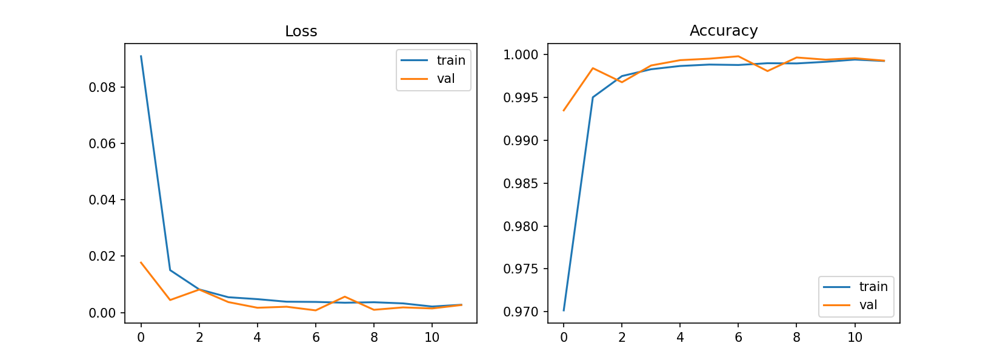
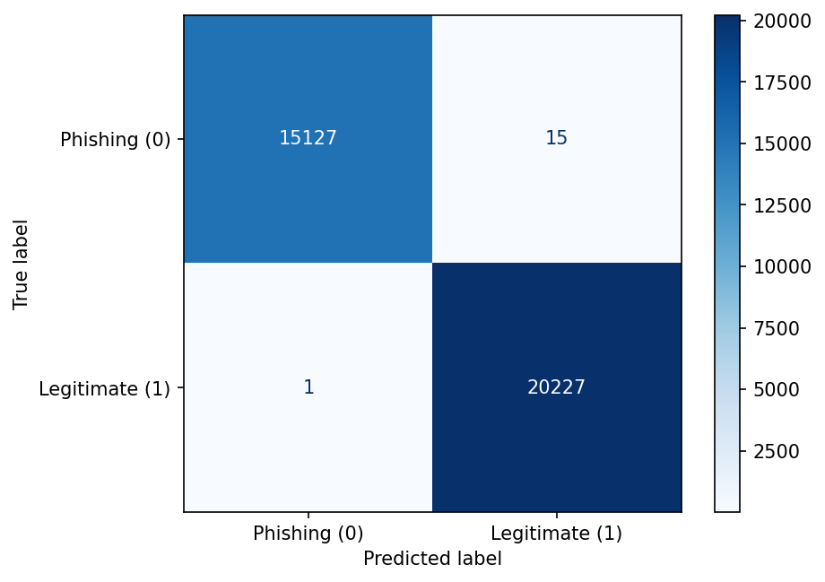

# SE4050 Deep Learning: Phishing Website Detection

## Overview
This repository contains an end-to-end deep learning framework designed to detect phishing websites using engineered URL and webpage features. We benchmark four distinct deep learning architectures under identical experimental conditions to critically evaluate their predictive performance, generalization, and computational efficiency for the SE4050 assignment.

The four architectures implemented are:
1. Multi-Layer Perceptron (MLP)
2. 1D Convolutional Neural Network (1D CNN)
3. Long Short-Term Memory (LSTM)
4. Gated Recurrent Unit (GRU)

## Dataset
**Dataset:** [PhiUSIIL Phishing URL Dataset](https://archive.ics.uci.edu/dataset/967/phiusiil+phishing+url+dataset) (UCI Machine Learning Repository)
*   The project strictly utilizes 50 engineered numerical features.
*   High-cardinality text attributes (e.g., `FILENAME`, `URL`, `Domain`) were excluded to maintain a controlled tabular environment.
*   To prevent data leakage, all preprocessing transformations (e.g., `StandardScaler`) were fitted exclusively on the training split before transforming the validation and unseen test sets.

## Repository Structure
*   `data/`: Contains instructions for dataset acquisition and the processed `.npy` arrays. *(Note: The raw CSV is ignored via `.gitignore` to prevent repository bloat).*
*   `notebooks/`: Jupyter notebooks for Exploratory Data Analysis (`01_EDA.ipynb`), Preprocessing (`02_preprocessing.ipynb`), and individual model training.
*   `src/`: Shared Python scripts for modular scaling pipelines and unified evaluation metrics.
*   `models/`: Serialized model weights (`.h5`) and architecture definitions.
*   `results/`: Exported confusion matrices, ROC curves, loss/accuracy learning curves, and evaluation CSVs.
*   `requirements.txt`: Python package dependencies required for exact reproducibility.
*   `report/`: Final PDF documentation and Turnitin similarity reports.

## Setup and Execution Instructions
1. **Clone the repository:**
   ```bash
   git clone https://github.com/milindasandaru/SE4050-Deep-Learning-Project-2026.git
   cd SE4050-Deep-Learning-Project-2026
   ```

2. **Create and activate virtual environment:**
   ```bash
   python -m venv venv
   # On Windows:
   .\venv\Scripts\activate
   # On Linux/macOS:
   source venv/bin/activate
   ```

3. **Install dependencies:**
   ```bash
   pip install -r requirements.txt
   ```

4. **Run the Notebooks in sequence:**
   - `01_EDA.ipynb`: Exploratory data analysis
   - `02_preprocessing.ipynb`: Data splitting (70/15/15) and StandardScaler fitting
   - `03_MLP.ipynb`: Multi-Layer Perceptron model
   - `04_CNN1D.ipynb`: 1D Convolutional Neural Network & Hyperparameter Tuning
   - `05_LSTM.ipynb`: Long Short-Term Memory model
   - `06_GRU.ipynb`: Gated Recurrent Unit model

---

## 1D CNN Model (Architecture & Tuning)

**Module:** `models/cnn1d.py`  
**Notebook:** `notebooks/04_CNN1D.ipynb`  
**Lead:** Milinda Sandaruwan

### Architecture Overview
The 1D CNN processes 50 tabular attributes reshaped into a tensor `(samples, 50, 1)`. The model features modular parameterization via `build_cnn1d()` to support controlled ablation and tuning.

```
Input (50, 1)
   -> Conv1D(32, kernel_size=3, ReLU)
   -> MaxPooling1D(pool_size=2)
   -> Conv1D(64, kernel_size=3, ReLU)
   -> MaxPooling1D(pool_size=2)
   -> Flatten()
   -> Dense(64, ReLU)
   -> Dropout(0.3)
   -> Dense(1, Sigmoid)
```

**Total Trainable Parameters:** 51,521 (Baseline)

### Controlled Hyperparameter Tuning
We conducted systematic controlled experiments recorded in `results/cnn1d/tuning/experiments.csv`:

| Experiment ID | Architecture / Variation | Parameters | Best Val Loss | Test Accuracy | Test Precision (Phishing) | Test Recall (Phishing) | Test F1-Score |
|---|---|---|---|---|---|---|---|
| **EXP-01_baseline** | Conv(32→64), k=3, Dense=64 | **51,521** | **0.000152** | **0.999887** | **1.000000** | **0.999736** | **0.999868** |
| **EXP-02_wider_filters** | Conv(64→128), k=3, Dense=64 | 115,201 | 0.000214 | 0.999887 | 1.000000 | 0.999736 | 0.999868 |
| **EXP-03_deeper_3layers** | Conv(32→64→128), k=3, Dense=64 | 63,937 | 0.000156 | 0.999915 | 1.000000 | 0.999802 | 0.999901 |
| **EXP-04_kernel_size_5** | Conv(32→64), k=5, Dense=64 | 47,489 | 0.000338 | 0.999802 | 0.999868 | 0.999670 | 0.999769 |
| **EXP-05_dense_128** | Conv(32→64), k=3, Dense=128 | 96,705 | 0.000169 | 0.999887 | 1.000000 | 0.999736 | 0.999868 |

*Key finding:* The baseline architecture (`EXP-01`) achieved the lowest validation loss (0.000152) while preserving computational efficiency (51k parameters vs 115k).

### Output Artifacts
All 1D CNN artifacts are structured under `results/cnn1d/`:
- `results/cnn1d/baseline/`: Baseline `metrics.json`, `history.json`, `confusion_matrix.png`, `roc_curve.png`, `training_history.png`
- `results/cnn1d/tuning/`: `experiments.csv` (complete parameter & metric logs)
- `results/cnn1d/final/`: Final model `config.json`, `metrics.json`, `cnn1d_final_model.keras`, and evaluation visual plots

---


## LSTM Model

**Notebook:** `notebooks/05_LSTM.ipynb`

### Why an LSTM?
An LSTM (Long Short-Term Memory) is a recurrent neural network that reads data step by step and keeps a memory of what it has seen. Its gates (input, forget, output) decide what to remember and what to discard, which avoids the vanishing gradient problem of plain RNNs.

Our data is tabular, so we treat the 50 features of each website as a sequence of 50 time steps with 1 value each. Inputs are reshaped from `(rows, 50)` to `(rows, 50, 1)`. This lets us compare the LSTM fairly with the MLP, 1D CNN, and GRU on exactly the same split.

### Data split
The data was scaled and split in `02_preprocessing.ipynb`, so all models share the same split.

| Split | Rows | Purpose |
|---|---|---|
| Train | 165,056 | Learning the weights |
| Validation | 35,369 | Early stopping |
| Test | 35,370 | Final evaluation (used once) |

### Architecture

```
Input (50, 1)
   -> LSTM(64)
   -> Dropout(0.3)
   -> Dense(32, ReLU)
   -> Dropout(0.3)
   -> Dense(1, Sigmoid)
```

| Layer | Purpose |
|---|---|
| `LSTM(64)` | Reads the 50-step sequence and outputs a 64-value summary |
| `Dropout(0.3)` | Randomly switches off 30% of units in training to reduce overfitting |
| `Dense(32, ReLU)` | Learns non-linear combinations of the LSTM output |
| `Dense(1, Sigmoid)` | Outputs a probability (closer to 1 means legitimate) |

**Total parameters:** 19,009.

### Training setup

| Setting | Value |
|---|---|
| Optimizer | Adam |
| Loss | Binary cross-entropy |
| Batch size | 256 |
| Max epochs | 50 |
| Early stopping | Monitor `val_loss`, patience 5, restore best weights |
| Random seed | 42 |
| Decision threshold | 0.5 |
| Hardware | Google Colab, T4 GPU |

Early stopping ended training after **12 epochs** (best weights from epoch 7) in about **76.6 seconds**.

### Results
The model was evaluated once on the held-out test set.

| Metric | Score |
|---|---|
| Accuracy | 0.99969 |
| Precision | 0.99956 |
| Recall | 0.99990 |
| F1-score | 0.99973 |
| ROC-AUC | 0.99999 |
| Parameters | 19,009 |
| Training time | 76.6 s |
| Epochs run | 12 |

#### Learning curves



- **Loss (left):** training and validation loss drop quickly in the first 2 epochs, then flatten near zero.
- **Accuracy (right):** both curves reach about 99.9% and stay together.
- The two curves stay close, so the model is **not overfitting**. The small bumps in validation loss are normal noise, handled by early stopping and restoring the best weights.

#### Confusion matrix



| | Predicted Phishing | Predicted Legitimate |
|---|---|---|
| **Actually Phishing** | 15,133 (TN) | 9 (FP) |
| **Actually Legitimate** | 2 (FN) | 20,226 (TP) |

Only **11 of 35,370** test websites were misclassified.
- **9 phishing sites were labelled legitimate.** This is the riskier error in security, since a phishing site gets through. Phishing recall is 15,133 / 15,142, about **99.94%**.
- **2 legitimate sites were flagged as phishing.** This is the less harmful error (a false alarm).

*Legitimate (1) is the positive class, so FP/FN in the metrics file follow that convention.*

### LSTM output files
All saved in `results/`:

| File | Contents |
|---|---|
| `lstm_metrics.json` | Final test metrics and confusion matrix counts |
| `lstm_history.json` | Loss and accuracy per epoch (train and validation) |
| `lstm_learning_curves.png` | Learning curves plot |
| `lstm_confusion_matrix.png` | Confusion matrix plot |
| `lstm_test_proba.npy` | Predicted test probabilities (for ROC curves and model comparison) |

### Reproducing the LSTM results
1. Open `notebooks/05_LSTM.ipynb` in Google Colab (GPU runtime recommended).
2. Upload `X_train.npy`, `y_train.npy`, `X_val.npy`, `y_val.npy`, `X_test.npy`, `y_test.npy` to `/content`.
3. Run all cells. Results are saved as `lstm_*` files.

The seed is fixed (42), but GPU training can still shift counts by a few samples between runs.
